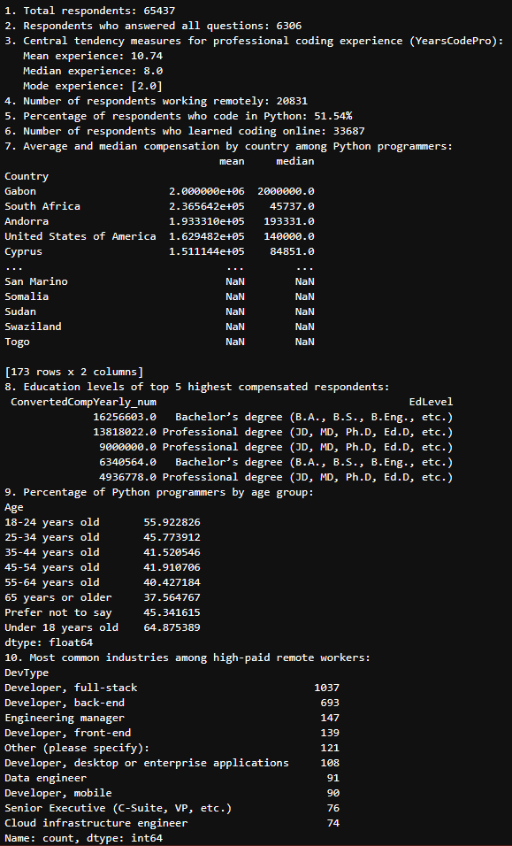

# Exploratory Data Analysis of Stack Overflow Developer Survey

## Overview

This project presents a comprehensive exploratory data analysis (EDA) of the Stack Overflow Developer Survey dataset, containing responses from over XX,000 developers worldwide. The goal is to extract actionable insights on developer experience, salary distribution, programming language popularity, and remote work trends.

---

## Project Goals

- Understand demographics and professional backgrounds of developers  
- Analyze global compensation trends, focusing on Python programmers  
- Examine remote work adoption and its correlation with compensation  
- Deliver data-driven insights for HR, talent acquisition, and strategic planning

---

## Dataset

- Source: [Stack Overflow Developer Survey](https://insights.stackoverflow.com/survey)  
- Files used:  
  - `survey_results_public.csv` — survey responses  
  - `survey_results_schema.csv` — question metadata

---

## Analysis Highlights

- Data preprocessing and cleaning of real-world survey data  
- Calculation of key statistics: mean, median, mode of coding experience and compensation  
- Segmentation by programming language and remote work status  
- Aggregation of salary data by country and education level  
- Visualization-ready summary tables and metrics

---

## Technologies

- Python 3.x  
- Pandas — data manipulation and analysis  
- Jupyter Notebook — interactive exploration  
- Matplotlib / Seaborn — optional visualization tools

---

## Usage

1. Download survey CSV files and place in project directory  
2. Run analysis scripts or notebook to reproduce results  
3. Review console output for summarized insights

---

## Business Value

This analysis informs recruiters and business leaders about the current global developer landscape, highlighting compensation disparities, remote work trends, and skill demands — enabling more informed hiring and retention strategies.
